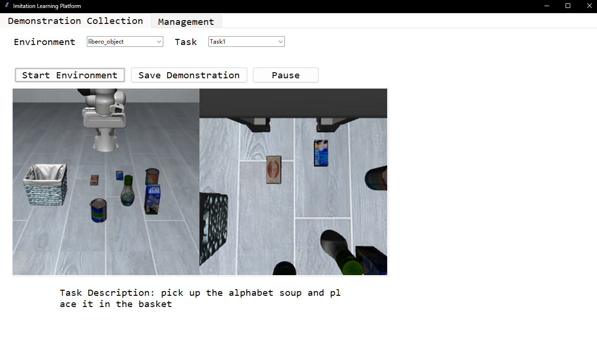
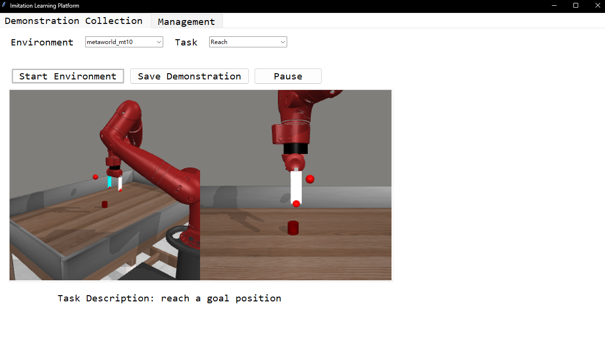
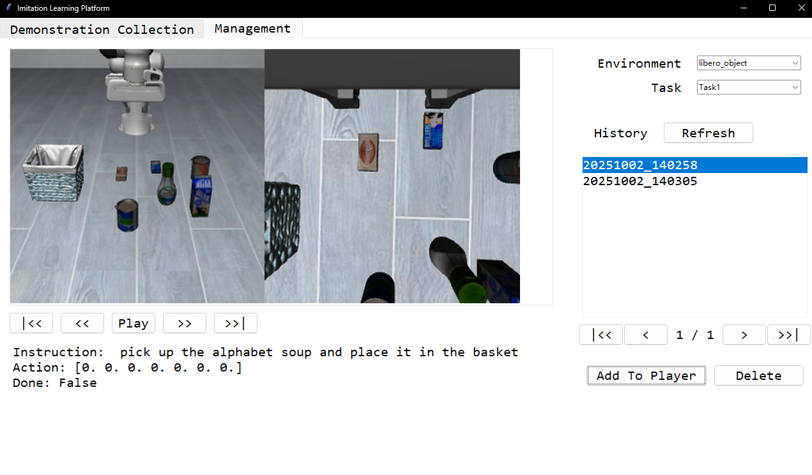

# DemoCat

A tool based on applications and scripts for collecting human demonstration data from simulated or physical environments.



---

## Introduction  

- **2024/09/19**: Our project is currently under active development. Contributions via pull requests (PRs) are warmly welcome! 😊  
- **2024/11/11**: Added support for the **Meta-World** environment.  
- **2025/10/01**: Added **multi-camera** support.  
- **2025/10/02**: Added support for the **LIBERO** environment.

---

## Installation  

Different environments require specific installation procedures. Please follow the instructions below according to your target environment.

### Meta-World

```bash
conda create -n democat_metaworld python=3.11 -y
conda activate democat_metaworld
pip install -r requirements.txt
pip install metaworld
```

### LIBERO

```bash
conda create -n democat_libero python=3.8 -y
conda activate democat_libero
pip install -r requirements.txt
git clone https://github.com/Lifelong-Robot-Learning/LIBERO.git third_party/LIBERO
cd third_party/LIBERO
pip install -r requirements.txt
pip install -e .
```

> **Note for Windows users (LIBERO only):**  
> You may need to install a patched version of `egl_probe` to ensure compatibility:
> ```bash
> pip install https://github.com/mhandb/egl_probe/archive/fix_windows_build.zip
> ```

---

## Running the Application  

To launch the GUI for human demonstration collection:

```bash
python gui.py
```

This will open the main interface, which includes two primary modules:

### Demonstration Collection Module  
This module allows you to collect demonstrations using predefined keyboard controls.



**Keyboard Shortcuts:**  
- `p`: Pause recording  
- `q`: Start/resume recording  
- `e`: Save the current trajectory

### Demonstration Management Module  
This module enables you to **view**, **delete**, and **manage** previously collected demonstrations.



---

## Adding a New Environment  

To integrate a new environment into DemoCat, follow these steps:

1. **Create an environment folder** under `environments/`, and implement a class that inherits from `BaseEnv` (defined in `environments/base_env.py`).  
   - Example implementations:  
     - `environments/libero/libero_env.py`  
     - `environments/metaworld/metaworld_env.py`

2. **Register the new environment and its tasks** in the environment manager.  
   Edit `app/environment.py` and update the `_register_default_environments` method in `EnvironmentManager`:

    ```python
    # Example: Registering Meta-World tasks
    self.register_environment('metaworld_mt10')  # Environment name
    self.register_task('metaworld_mt10', 'Reach', Reach)
    self.register_task('metaworld_mt10', 'Push', Push)
    # ... add more tasks as needed

    # Example: Registering LIBERO tasks
    self.register_environment('libero_object')
    self.register_task('libero_object', 'Task1', libero_object_task_0)
    self.register_task('libero_object', 'Task2', libero_object_task_1)
    ```

Ensure your new environment follows the same interface and data format conventions to maintain compatibility with the rest of the system.
