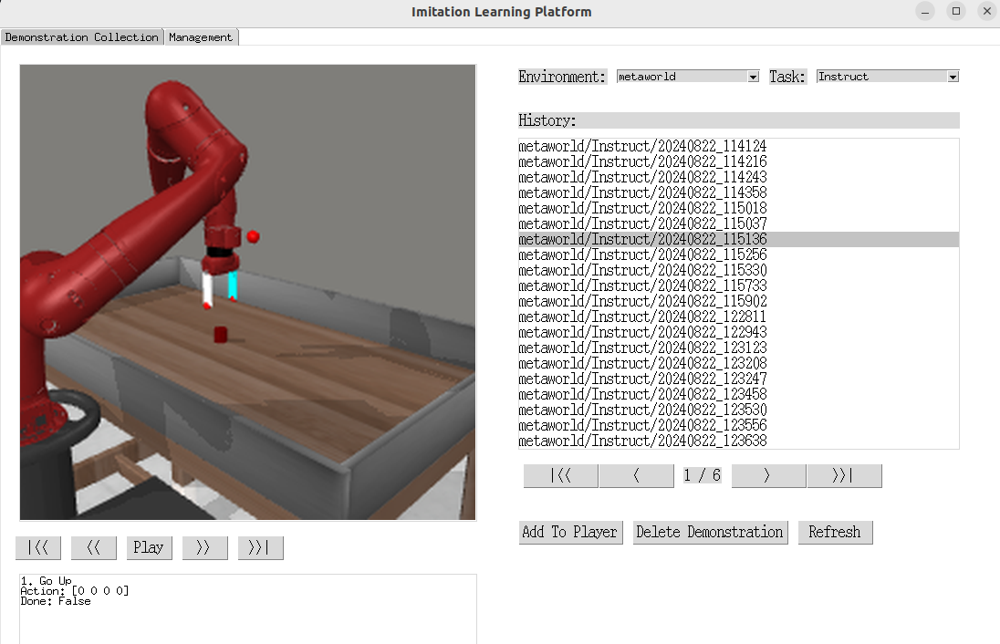

# DemoCat
An app and scripts based tool to collect human data from simulated or physical environments.

## Introduction

- ```2024/09/19``` Our project is currently in the process of building, Welcome PR! ^_^

### Demonstration Collection


### Demonstration Management



## Installation

### MetaWorld

You can follow the [Installation](https://github.com/AoqunJin/Metaworld) in my MetaWorld folk.

### Gym

```bash
pip install "gym[atari, accept-rom-license]"
```
